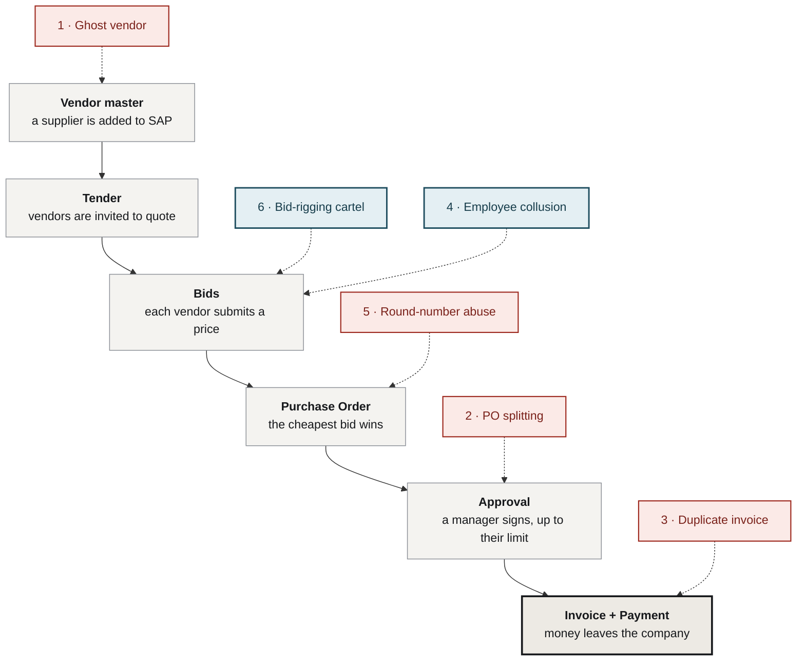
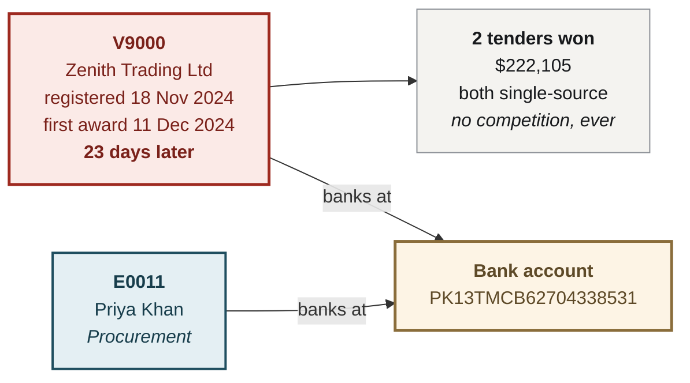
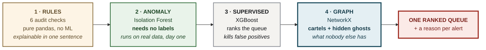
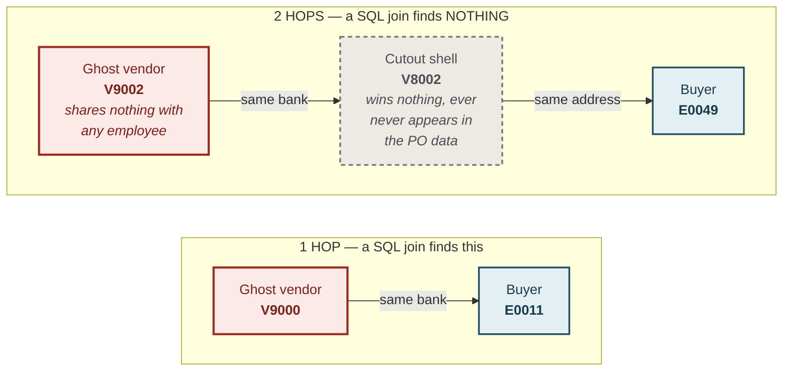
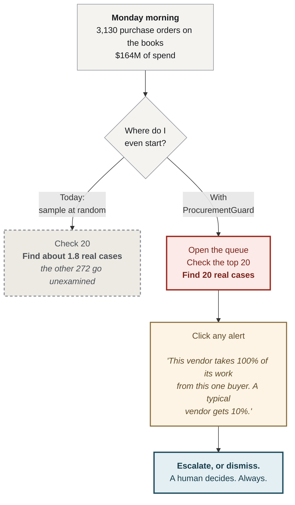

# ProcurementGuard — Product Requirements

**Status:** Days 1–7 complete · Live at `procurementguard.streamlit.app`
**Audience:** anyone. No ML background assumed.
**Every example below is real** — pulled straight out of the running system, not
invented for the document.

---

## 1. The problem, in one paragraph

A company buys things. People inside the company decide **who** it buys from and
**how much** it pays. Some of them steal — not by taking cash out of a drawer,
but by bending the purchasing process until money flows somewhere it should not.
It is quiet, it is legal-looking, and every individual transaction passes every
check the ERP has.

Nobody at a mid-market company is looking. Not because they don't care, but
because the only tools that do this are priced for the Fortune 500.

> **ProcurementGuard reads the purchasing data a company already has, and hands
> an auditor a ranked list of the twenty transactions most worth opening — with a
> plain-English reason for each.**

---

## 2. How buying works — and where it breaks



**Red** = the fraud lives inside a row, or a handful of rows.
**Blue** = the fraud lives *between* records — and **only a graph can see it.**

### The one idea everything else hangs from

> A manager can only approve up to a limit. That control exists to stop one
> person spending big money unwatched.
>
> **PO splitting exists *because* that limit exists.**
>
> **The control creates the fraud.** And the system cannot see it, because it
> checks one row at a time — **and fraud lives between rows.**

---

## 3. The six schemes — with real examples from our data

### 2 · PO splitting

**The trick:** break one purchase into several, each just under the ceiling, so
no manager ever sees the real total.

**A real one. Buyer `E0050`. Approval limit: $25,000.**

| Tender | Date | Vendor | Amount | Under the limit? |
|---|---|---|---:|:---:|
| `T00872-S0` | 19 Sep 2025 | V0058 | **$23,303** | yes |
| `T00872-S5` | 20 Sep 2025 | V0058 | **$23,527** | yes |
| `T00872-S2` | 23 Sep 2025 | V0058 | **$22,397** | yes |
| `T00872-S4` | 23 Sep 2025 | V0058 | **$22,637** | yes |
| `T00872-S3` | 25 Sep 2025 | V0058 | **$21,711** | yes |
| `T00872-S1` | 26 Sep 2025 | V0058 | **$22,288** | yes |
| | | **TOTAL** | **$135,863** | **5.4× the limit** |

**Six POs. One vendor. One buyer. Seven days.** Every one of them is legal. SAP
approved all six without a murmur, because **each one obeys the rule.**

**Nobody senior ever saw a $135,863 purchase.** Because on paper, there wasn't one.

---

### 3 · Duplicate invoice

```
Week 1    Vendor bills   INV-1023     $50,000   →  paid    (legitimate)
Week 4    Vendor bills   INV-1023A    $50,000   →  paid    (same goods, again)
                              ^
                      one letter different
```

**Why it works:** the company processes **5,000 invoices a month.** The clerk
paying it does not remember a bill from three weeks ago. The vendor is real. The
amount looks normal. The invoice number is *different.*

**A computer remembers. That is the entire rule.**

---

### 1 · Ghost vendor

**The trick:** invent a supplier that does not exist.



**No office. No staff. No goods.** Just a row in the vendor master.

The employee raises POs to it, marks goods as "received", and the company pays —
**into a bank account that is her own.**

| | Bank account |
|---|---|
| Vendor **V9000** — *Zenith Trading Ltd* | `PK13TMCB62704338531` |
| Buyer **E0011** — *Priya Khan* | `PK13TMCB62704338531` |
| | **identical** |

**Nothing in `tenders.csv` can say this.** The vendor's bank lives in one file,
the buyer's in another, and the tender table only ever holds their **IDs**.
**The fact exists only between the two records.**

---

### 4 · Employee collusion

**The trick:** the vendor is **real**. It exists. It delivers. But a buyer
secretly linked to it steers work their way.

| | Ghost vendor | **Employee collusion** |
|---|:---:|:---:|
| Does the company exist? | no | **yes** |
| Do the goods arrive? | never | **yes** |
| Is the paperwork legal? | mostly | **completely** |
| What is stolen? | everything | **the overcharge** |

Ayesha's brother-in-law runs *Vertex Industrial*. Real office. Real staff. Real
deliveries. Their arrangement: *"Send me the company's work. I'll cut you in."*

**She forges nothing. She just bends:**

- invites **2** bidders instead of 5
- invites the ones she knows are expensive
- Vertex quotes **$60,000** where the market rate is **$40,000**
- she approves it

**Every record is legal. The goods arrive.** The company just paid **$20,000 too
much.** Every time.

**How we catch it — the ratio nobody thinks to compute:**

> *"What share of this **vendor's** work comes from **one** buyer?"*

| | |
|---|---:|
| an honest vendor | **11%** — spread across many |
| a **colluding** vendor | **55%** |
| a **ghost** vendor | **100%** — it exists only to serve its creator |

*(For a year this ratio was computed the other way round — "what share of this
**buyer's** spend went to one vendor?" — and it separated **nothing**, because a
buyer runs 50 tenders and no single vendor is ever a large slice. Flipping the
denominator took one line and moved collusion recall from **23% to 100%.**)*

---

### 5 · Round-number abuse

```
A real invoice:      $47,283.61     quantity x unit price x tax.  Messy.
A fabricated one:    $50,000.00     a human picked it.
```

Nobody making up a number writes 47,283.61. **And it is worse when the round
number sits just under a ceiling** — $23,000 against a $25,000 limit is a number
chosen by a person, not produced by a transaction.

---

### 6 · Bid-rigging cartel — *this one is the whole project*

**The trick:** several vendors secretly agree to **stop competing**, and take
turns winning.

#### Look at one of their tenders. `T01508`, 4 Feb 2024.

| Vendor | Bid | |
|---|---:|---|
| **V0108** | **$9,532** | **won** |
| V0069 | $10,488 | |
| V0125 | $10,546 | |
| V0092 | $11,792 | |
| V0234 | $13,021 | |

**Five bidders. Cheapest wins. Perfectly clean.** Examine it for an hour and you
will find nothing, **because there is nothing in it to find.**

#### Now here is what you could not see

**V0108 and V0234 are in a ring together.** V0234's $13,021 was a **cover bid** —
a bid submitted *in order to lose*, deliberately padded, so its partner's price
looks like a bargain.

Look again at the numbers. The three honest outsiders bid **$10,488, $10,546,
$11,792** — clustered, competitive, all within 13% of one another. And V0234 bid
**$13,021** — nearly **37% above the winner.**

**Nobody trying to win a contract bids 37% over the market.**

#### And here is what is invisible in any single row

**Who won, in order, across everything this group touched:**

```
V0148  →  V0060  →  V0234  →  V0108  →  V0148  →  V0108  →  V0060
   →  V0234  →  V0108  →  V0148  →  V0108  →  V0060  →  V0234
   →  V0234  →  V0108  →  V0148  →  V0060  →  V0148  →  V0234
```

| Vendor | Share of wins |
|---|---:|
| V0148 | **32%** |
| V0234 | **24%** |
| V0060 | **22%** |
| V0108 | **22%** |

**They are taking turns.** Everybody gets a share.

**That is not a market. That is a rota.**

> In honest competition there is a cheapest supplier, and it wins **more than its
> share.** A cartel gives everyone a turn, so the wins come out **flat.**
>
> **That flatness is the fingerprint — and it does not exist inside any single
> tender. Only across all of them.**

**45 features. Two models. Honest validation.**
**Result: 1 of 49 cartel tenders caught.**

**That is not a failure. It is the proof.** And it is the argument for everything
in the next two sections.

---

## 4. Why nobody has solved this already

**SAP does sell fraud detection** — *SAP Business Integrity Screening*, part of
the GRC suite. **Never claim SAP cannot do this.** A SAP consultant will call it
in the first minute.

| | Base SAP | SAP GRC | **ProcurementGuard** |
|---|:---:|:---:|:---:|
| **Blocks** a PO over the limit | yes | yes | — |
| Segregation of duties | yes | yes | — |
| Three-way match | yes | yes | — |
| **Detects** patterns across rows | **no** | yes | **yes** |
| Finds cartels | **no** | partial | **yes** |
| Finds a ghost hidden behind a shell | **no** | **no** | **yes** |
| Works with **no labelled fraud** | — | limited | **yes** |
| **Price** | included | **six figures + 6–18 months of consultants** | **~$0** |

**Base SAP prevents. It does not detect.** It checks one row at a time, and it is
extremely good at that — **which is exactly why PO splitting works.**

**GRC detects, and it is priced for the Fortune 500.** A mid-market SAP shop does
not buy it — not because they don't want detection, but **because the only option
on the market costs more than the fraud does.**

> **This is a distribution gap, not a technology gap.**
> That distinction *is* the pitch, and it is the honest one.

---

## 5. What we built



| Scheme | Rules | Anomaly | XGBoost | **Graph** |
|---|:---:|:---:|:---:|:---:|
| PO splitting | **100%** | yes | yes | — |
| Duplicate invoice | **100%** | yes | yes | — |
| Round-number abuse | **100%** | yes | yes | — |
| Employee collusion | **100%** | partial | yes | yes |
| Ghost vendor | **96%** | yes | yes | **yes — incl. 2-hop** |
| **Bid-rigging cartel** | **2%** | no | **1 / 49** | **2 / 2 rings, exactly** |

---

## 6. The two questions you *will* be asked

### *"A SQL join finds a shared bank account. Why do I need a graph?"*

**Because the careful fraudster does not bank in his own name.**



```sql
SELECT * FROM vendors v
  JOIN employees e ON v.bank_account = e.bank_account;
```

For **V9002**, that query returns **zero rows.** It shares no identifier with any
employee at all — its bank belongs to **V8002**, a shell that never wins a
tender and never appears in the purchase-order data, and *that* shell shares an
address with buyer **E0049**.

*(There are two such ghosts in this build: V9002 → V8002 → E0049, and
V9006 → V8006 → E0013. Seven of the nine ghosts are the easy, direct kind. The
two layered ones are the whole reason the graph exists.)*

> **Two hops is not a harder join. It is a different question — and only a graph
> can ask it.**

### *"Then just train a model on cartels."*

**You cannot.** There are **two** rings in this data. Hold one out to test on, and
the model trains on **exactly one example of a cartel.**

```
fold 1:   TRAIN has 24 cartel tenders   |   TEST has 25
fold 2:   TRAIN has 25 cartel tenders   |   TEST has 24
fold 3:   TRAIN has 49 cartel tenders   |   TEST has  0
```

**No model learns a pattern from one example.**

And **no company on earth has a hundred labelled cartels to learn from.** They
will have one, if they are unlucky. Maybe two.

> **Supervised learning cannot solve cartels. Not here, not anywhere.**
>
> **The graph needs no labels at all.** It found both rings, exactly, ranked first
> and second, from nothing but *who bids against whom* and *who takes their turn
> winning.*

---

## 7. Who uses it, and how

**The user is an internal auditor. They have about twenty hours this week.**



### Two screens, not one

| Screen | Answers | Why it must exist separately |
|---|---|---|
| **Alerts** | *"Which twenty do I open?"* | The queue. Sortable by **likelihood** or by **money at risk** — they disagree, and that disagreement is worth a slide of its own. |
| **Cartels** | *"Are any vendors working together?"* | **A cartel is not a property of a tender. It is a property of a group of vendors.** You do not tell an auditor *"tender T01508 is rigged."* You tell them *"these four firms are an arrangement,"* and every tender they touched comes with it. |

### What one alert actually looks like

> ### #1 · `T02727-S2` · $483,462 · vendor V0050
>
> **Several rules fired at once** &nbsp;&nbsp; `rule`
> `████████████████████████████████████████`
> *2 separate audit rules flagged this tender independently. Any one of them
> alone is common. 2 together is not.*
>
> **PO splitting rule fired** &nbsp;&nbsp; `rule`
> `████████████████████████████`
> *An audit rule written by a human, not a model, flagged this.*
>
> **This pair keeps trading** &nbsp;&nbsp; `transaction`
> `██████████████`
> *This buyer has awarded this vendor 4 tenders. The usual buyer-vendor pair has
> done 1.*
>
> **Sitting under the ceiling** &nbsp;&nbsp; `transaction`
> `██████`
> *The award is **97%** of the approver's limit — just under the ceiling, where a
> splitter would put it.*

**Bar length = how hard that fact pushed this tender up the queue.** Measured with
SHAP, against the model that never saw it.

**The number is deliberately never shown.** `+0.31` tells an auditor nothing they
can act on. **The bar is the number.**

---

## 8. Does it work?

3,130 tenders · 274 fraudulent (8.75%) · **$17.9M of exposure**

| Metric | Result | Meaning |
|---|---|---|
| **Precision @ 20** | **100%** | The auditor's top 20 are **all real.** Not one wasted morning. |
| **Lift** | **11.4×** | Random sampling finds 1.8 cases. This finds 20. |
| **PR-AUC** | **0.83** | The whole ranking, not just the top. Random scores **0.088.** |
| **Money recovered, top 50** | **63.4%** | Sorted by expected loss, **fifty checks reach two-thirds of all the money at risk.** |
| **Cartels found** | **2 of 2, exactly** | Every member. No strays. **Zero labels used.** |
| **Isolation Forest alone** | **P@20 = 70%** | **With no ground truth at all.** This is the layer that runs on real data tomorrow. |

### Never quote "accuracy"

91% of tenders are clean. **A model that flags nothing at all scores 91%
accuracy.** It would be useless, and it would look excellent.

**Quote Precision@20, PR-AUC and lift — numbers that cannot be gamed by doing
nothing.**

---

## 9. What it deliberately does **not** do

| It does not… | Because… |
|---|---|
| **Block payments** | The moment a model can stop money on its own, **someone has to own its mistakes.** Nobody will sign that. |
| **Accuse anyone** | It produces a queue and a reason. **A human decides. Always.** |
| **Touch the ERP** | It reads an export. **Zero write access, zero risk to SAP.** |
| **Need labelled fraud** | The anomaly layer and the graph both work with **no ground truth at all** — which is the actual situation at every real company. |

> **This is not a product. It is an experiment that answers one question:**
>
> ***"Is there enough leakage in this company's procurement data to be worth
> looking for?"***
>
> **Yes** → there is now a business case, with a number attached to it.
> **No** → the company just saved itself a six-figure GRC licence.
>
> **Both answers are wins.** That is what makes it hard to argue with.

---

## 10. Honest limitations — say these before anyone else does

1. **Every number above is measured on data we generated ourselves.** It proves
   the *code* works. It does **not** yet prove the *idea* works. **Until real data
   lands, do not oversell.**
2. **8.75% contamination is generous.** Real procurement fraud runs **1–3%**,
   often under 1%. Re-running at 1% is scheduled — and **if precision collapses
   there, that is an honest finding. Reporting it makes the work more credible,
   not less.**
3. **The rules may be flattering themselves.** They are tested against a generator
   written by the same person who wrote the rules. Real data is messier.
4. **n = 2 cartels.** The detector found both, exactly. That is a **demonstration,
   not a statistic.**

---

## 11. Roadmap

| Day | Deliverable | |
|---|---|:---:|
| 1–2 | Synthetic dataset · six schemes · ground truth · **leak tripwire** | done |
| 3 | Rules engine — six audit checks | done |
| 4 | Features · Isolation Forest · XGBoost · **feature tripwire** | done |
| 5 | Graph — identity, co-bidding, **ring detector** | done |
| 6 | **Deploy.** Dashboard, live URL | done |
| 7 | **SHAP** — a reason behind every alert, in English | done |
| 8 | LLM narration — the reason, written as prose | |
| 9 | **Real data.** World Bank contract awards + their public **debarred-firms list.** **If even one firm in our top 20 was really debarred, that single slide outweighs every synthetic number in this document.** | |
| 10–11 | Polish · slides · rehearsal | |
| 12–14 | Buffer. Something always breaks here. | |

---

## Appendix — vocabulary

| Term | Plain English |
|---|---|
| **ERP** | The one system a company runs everything on — money, stock, staff, purchasing. |
| **SAP** | The world's biggest ERP. Most large companies run it. |
| **SAP MM** | *Materials Management* — the purchasing part of SAP. **Our domain.** |
| **Tender** | *"We need this. Who can supply it, and for how much?"* |
| **Bid** | One supplier's price, in answer to a tender. |
| **PO** *(Purchase Order)* | The binding order issued to whoever won. |
| **Approval limit** | The most a given manager may sign off alone. Here: **$25k, $100k or $500k.** |
| **Single-source** | Awarded with **no competition at all.** Sometimes legitimate. Always worth a look. |
| **Cover bid** | A bid submitted **in order to lose** — deliberately padded, so a friend's price looks cheap. |
| **Ground truth** | The right answer, known in advance. We have it **only because we planted the fraud ourselves** — and that is also the exact limit of what these numbers can prove. |
