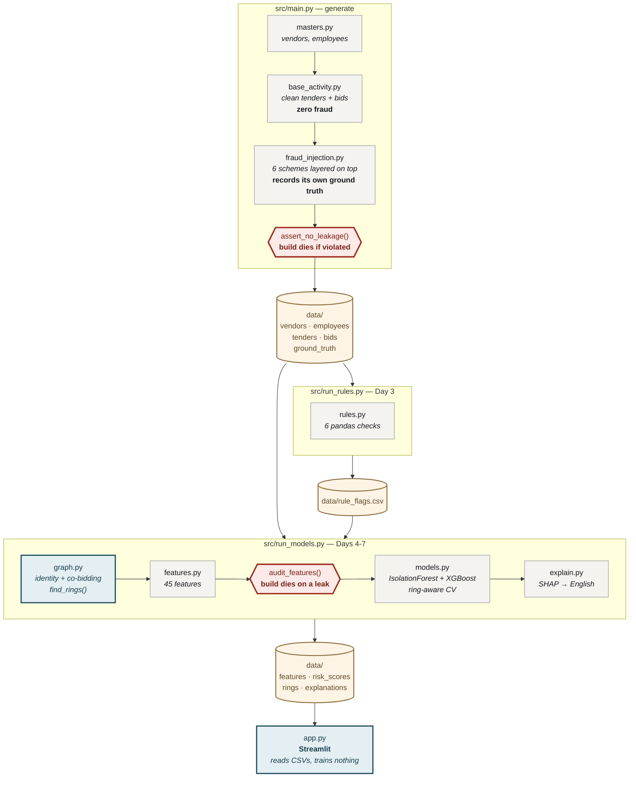
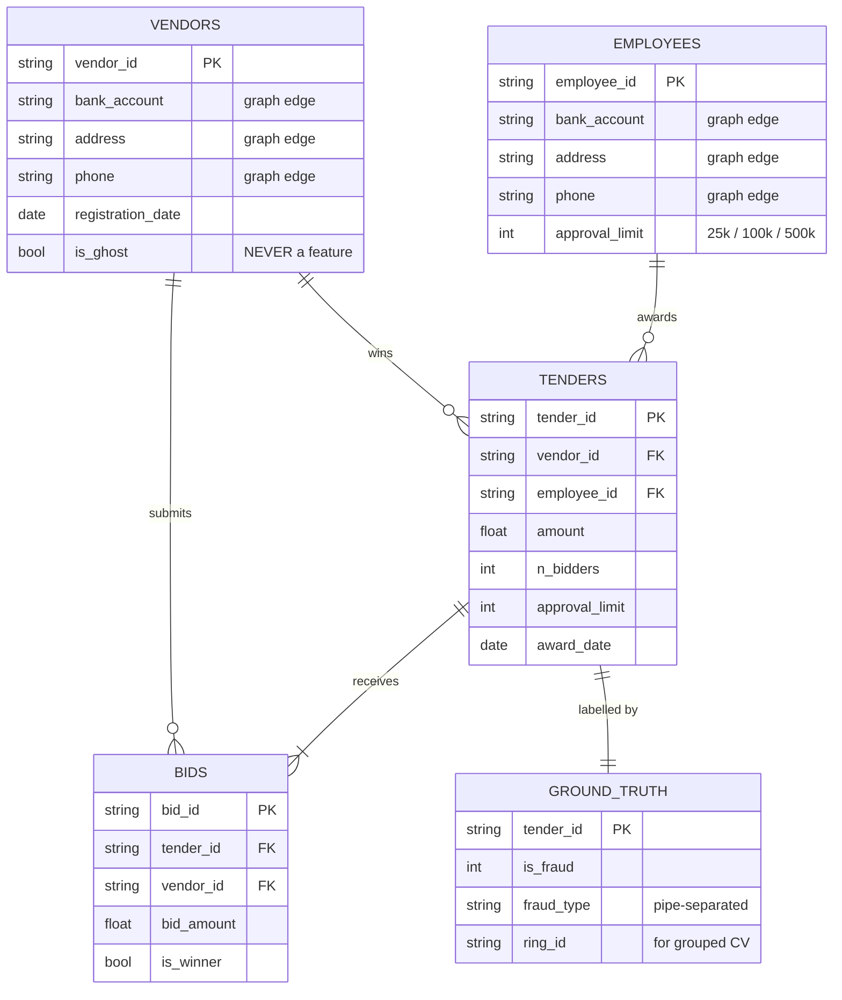
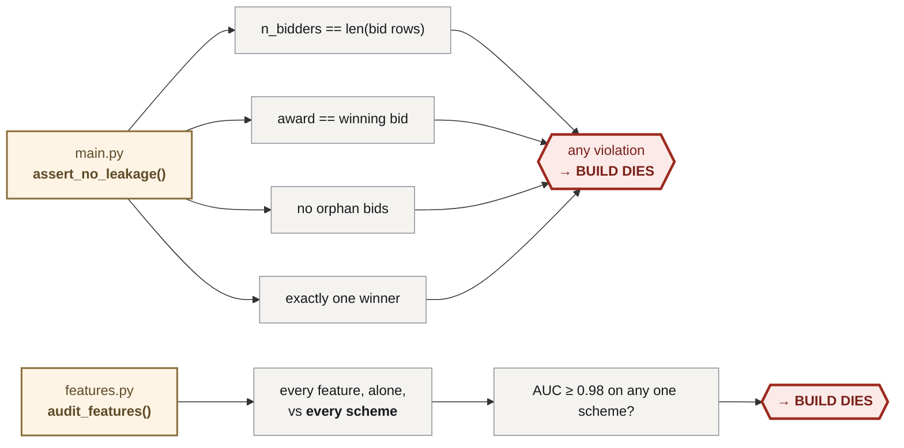
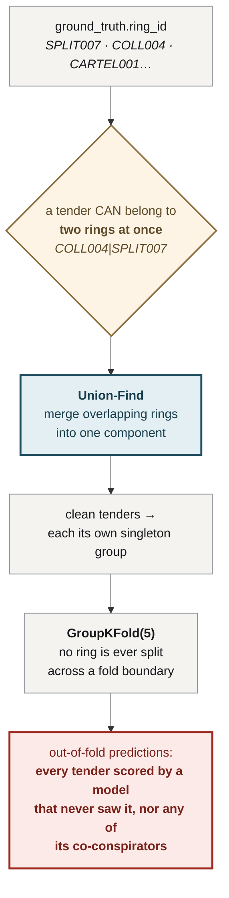
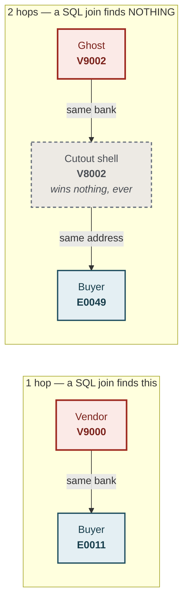
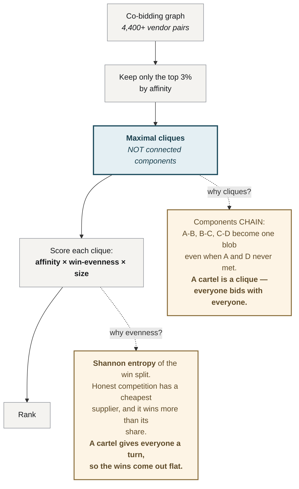

# ProcurementGuard — Technical Requirements

**Status:** Days 1–7 complete
**Stack:** Python 3.11+ · pandas · scikit-learn · XGBoost · NetworkX · SHAP · Streamlit
**Size:** ~2,900 lines across 15 modules
**Audience:** engineers. Assumes you can read Python and have met a decision tree.

---

## 1. Architecture

The whole system is a **batch pipeline that writes CSVs, and a dashboard that
reads them.** Nothing is trained at page load. Procurement audit is a batch
process by nature — a dashboard that retrains on every request is a dashboard
that times out on every request.



Run it:
```bash
python -m src.main        # → 5 CSVs, then assert_no_leakage()
python -m src.run_rules   # → rule_flags.csv
python -m src.run_models  # → features, risk_scores, rings, explanations
streamlit run app.py
```

---

## 2. Data model



**Current build:** 3,130 tenders · 11,610 bids · 311 vendors (11 ghost, incl. 2
cutouts) · 60 employees · **274 fraudulent (8.75%)** · £164M total spend, £17.9M
of it exposed.

**Note `bank_account`, `address` and `phone` on *both* vendors and employees.**
No column in `tenders` can say *"this vendor banks where this buyer banks."* That
fact exists only **between** two records. That is the graph, and it is why those
fields exist at all.

---

## 3. The data generator, and why it is the hard part

Everything downstream is measured against labels. **If the labels lie, every
number in this repo is fiction.** So the generator has one architectural rule:

```
base_activity.py    →  builds a clean world.  NO fraud in it. At all.
fraud_injection.py  →  layers fraud on top.   Records every row it touched.
```

A row is labelled fraudulent **because we put fraud in it** — never because the
generator drifted.

### ⚠️ It leaked. Six times. Read this before you trust anything.

The first model scored **PR-AUC 0.950**. It looked superb. It was exploiting
bugs.

| # | Leak | Precision as a standalone detector |
|---|---|---|
| 1 | `vendors.is_ghost` — ground truth sitting in the vendor master, looking exactly like a feature | **1.000** |
| 2 | No *clean* amount was ever round, so `amount % 5000 == 0` was a perfect tell | **1.000** |
| 3 | Collusion inflated `tenders.amount` but never updated `bids` — so `award ≠ winning_bid` fired on collusion **and nothing else** | **1.000** |
| 4 | Splitting / duplicate / collusion rewrote the PO **header** but not the **bid rows** — so `n_bidders ≠ len(bids)` was a free label | **1.000** |
| 5 | *(Day 5)* Cartel injection wiped every outside bidder, so **the exact same bidder set** recurred 8–16 times. `g_group_repeat` separated cartel **perfectly** | **1.000** |
| 6 | *(Day 5)* Cartel rigged only ~5% of its category, so co-bidding affinity was diluted into noise — an *unrealism* leak, not a code bug | — |

Leaks 1–4 together: **precision 1.000, recall 0.609.** A four-line detector with
zero intelligence found **61% of all fraud.**

### The lesson that actually matters

> **You cannot fix a data leak by blacklisting features.**
>
> We removed the derived column `bidder_desync`. XGBoost simply rebuilt it from
> `n_bidders` and `n_bid_rows` — two of the most obvious features imaginable.
> **The leak was in the data.** It had to be fixed in the generator.

### Two tripwires. Never delete them.



**`audit_features()` per-scheme check is not a detail — it is the whole point.**

The first version only checked AUC against *all* fraud, and **`g_group_repeat`
sailed straight through.** It nailed **every cartel tender in the build, perfectly**, while scoring a bland
global AUC of **0.57**, because the other 223 fraud rows drowned it out.

A feature can be a perfect oracle for one scheme and look innocent overall. **So
audit per scheme, or don't bother auditing.**

---

## 4. Layer 1 — Rules (`rules.py`)

Six pandas checks. No ML. Every one is something an auditor already knows to look
for, and every one is **explainable to a non-technical person in one sentence** —
that is the entry requirement.

| Rule | Logic | Flagged | Precision | Recall |
|---|---|---|---|---|
| `po_splitting` | same vendor + buyer, ≤14 days apart, each ≥75% of the limit, summing over it | 114 | **99.1%** | 41.2% |
| `duplicate_invoice` | same vendor, amount within 1%, ≤60 days apart. **Flags only the later invoice** | 58 | 79.3% | 16.8% |
| `thin_competition` | ≤2 bidders on an award over £50k | 235 | 21.3% | 18.2% |
| `round_near_threshold` | multiple of 1,000 **and** within 15% below the ceiling | 30 | 83.3% | 9.1% |
| `vendor_concentration` | a vendor drawing ≥40% of its work from **one buyer** | 56 | **89.3%** | 18.2% |
| `new_vendor_large_first` | first-ever award, >£40k, ≤30 days after registration | 9 | **100%** | 3.3% |
| **any rule fires** | | **433** | **52.0%** | **82.1%** |
| **2+ rules fire** | | 64 | **98.4%** | 23.0% |

### Two design notes worth stealing

**`duplicate_invoice` flags only the *later* invoice.** The first bill was
legitimate; the second is the one that moved money, and it is the only one ground
truth calls fraud. Flagging both halves of every pair manufactures a false
positive for every true positive. On the build where this was measured, precision went **63.9% → 77.6%** from one
change of loop variable. Both invoice IDs still appear in the reason text, so the
auditor loses nothing.

**`vendor_concentration` originally measured the wrong direction.** It asked
*"what share of this **buyer's** spend went to one vendor?"* — which separates
nothing, because a buyer runs 50 tenders and no single vendor is ever a large
slice. It fired **4 times at 0% precision.** Dead code.

Flip the denominator — *"what share of this **vendor's** work came from one
buyer?"*:

| | value |
|---|---|
| honest vendor | **0.11** |
| colluding vendor | **0.55** |
| ghost vendor | **1.00** (by construction — it only exists to serve its creator) |

Same groupby. Same data. **Employee-collusion recall went 23% → 100%.**

---

## 5. Layer 2 — Anomaly (`models.py :: isolation_forest_score`)

**Isolation Forest. Unsupervised. It never sees a label — check the function
signature yourself, `y` is not a parameter.**

Build random trees. Split on random features at random thresholds. **A point
that gets isolated in few splits is weird**, because weird points are easy to cut
off from the crowd. Score = how few splits it took.

```
PR-AUC 0.328 · Precision@20 = 70%
```

Read that again. **With zero ground truth, 14 of the top 20 alerts are real
fraud.** Against a base rate of 8.75%, that is an **8× lift from nothing.**

> **This is the only layer that could run on a real company's data tomorrow.**
> No company has labelled fraud. They never will. Everything else in this repo
> is a story about what becomes possible *if labels ever exist*. **This one works
> without them, and that makes it the most important layer in the system —
> whatever the PR-AUC says.**

Rule flags are **deliberately excluded** from its input. Hand it the rules'
conclusions and it stops being an independent signal, and the ablation below
stops meaning anything.

---

## 6. Layer 3 — Supervised (`models.py :: xgboost_oof_score`)

XGBoost. **Default hyperparameters. On purpose.**

> Tuning a model against labels you planted yourself measures nothing except how
> well you tuned. The hours are better spent on the graph.

### The honest-validation problem

A cartel plants ~25 tenders sharing the same four vendors. Split them randomly
and the model sees vendor `V0234` win in the training fold, then "predicts"
`V0234` in the test fold. **That is not detection. It is memorisation, and it
inflates every number you report.**



**Union-Find is not decoration — it is a guard.** A tender can belong to two
rings at once (`COLL004|SPLIT007`), because a colluding vendor can also be
splitting POs. A group key must be a single label, so overlapping rings have to
be merged into one component first, or `GroupKFold` silently leaks them across
the fold boundary.

**In the current build there happen to be zero compound rings** — an earlier one
had three. The code stays. A guard that only runs when something goes wrong is
still doing its job on the days nothing does.

### 45 features

| Group | n | Examples |
|---|---|---|
| Transaction | 10 | `log_amount`, `amount_over_limit`, `headroom_to_limit`, `is_round`, `n_bidders` |
| Price vs peers | 2 | `amount_z_in_category`, `amount_vs_cat_median` |
| Vendor | 6 | `vendor_age_days`, `vendor_n_buyers`, `days_reg_to_first_award` |
| Buyer | 3 | `buyer_n_tenders`, `buyer_n_vendors` |
| **The pair** | 3 | **`buyer_exclusivity`** ← the strongest non-graph feature |
| Bid shape | 3 | `bid_cv`, `bid_spread`, `winner_margin` |
| Rule flags | 7 | the six rules + `n_rules_triggered` |
| **Graph** | **11** | see §7 |

**Blacklisted by assertion:** `is_ghost` (config `LEAKY_COLUMNS`). No real SAP
vendor master carries a column that says *"this supplier is fake."*

---

## 7. Layer 4 — Graph (`graph.py`)

Two graphs. Two different kinds of fact a table cannot hold.

### 7a · Identity graph — *who is secretly who*



Nodes: vendors + employees. Edges: a shared `bank_account`, `address` or `phone`
— **vendor↔employee and vendor↔vendor** (the second is where the cutout lives).

```python
g_direct_shared_ids        # what a SQL join would have found
g_hops_to_buyer            # BFS distance. 1 = direct. 2 = there is a shell in between.
g_reachable_within_2_hops
g_vendor_emp_degree
g_identity_component_size
```

`SELECT * WHERE v.bank = e.bank` returns **∅** for the 2-hop ghosts (**V9002** and
**V9006** in this build). They share nothing with any employee. Only a traversal
reaches the buyer.

### 7b · Co-bidding graph — *who has stopped competing*

Nodes: vendors. Edge weight: how many tenders they both bid on.

Raw counts are useless — a busy vendor co-bids with everyone. **Normalise to
affinity:**

```
affinity(a,b) = co_bids(a,b) / min(total_bids(a), total_bids(b))
```

> *"Of the tenders these two could have met on, how often did they actually
> meet?"*

Guard: `min(bids) ≥ 8`. A vendor that bid twice, both times beside the same firm,
scores an affinity of 1.0 and means nothing. **Two data points are not a
pattern.**

### 7c · `find_rings()` — the cartel detector



**Result — no labels used anywhere in this table:**

```
#  vendors                    tenders  affinity  evenness  score   verdict
1  V0060,V0108,V0148,V0234         62     0.504     0.989   2.00   ** CARTEL001 — EXACT **
2  V0002,V0147,V0153               35     0.500     0.999   1.50   ** CARTEL000 — EXACT **
3  V0037,V0060,V0108,V0148         60     0.402     0.904   1.45   partial (overlaps #1)
4  V0080,V0116,V0211               36     0.309     0.987   0.91   false positive
```

**Two cartels planted. The top two suspects match both, exactly — every member,
no strays.**

The separation is clean and it is honest:

| | affinity |
|---|---|
| core ring pairs | **min 0.463**, mean 0.503 |
| every other pair | mean 0.135, **p99 0.286** |

The *weakest* ring pair beats the 99th percentile of everything else.

---

## 8. Layer 5 — Explanations (`explain.py`)

**SHAP** — *SHapley Additive exPlanations.* Lloyd Shapley, Nobel 2012: the only
provably fair way to split a payout among cooperating players. Swap *players →
features* and *payout → prediction*, and you get each feature's fair share of the
score.

Computed **per fold**, by the model that never saw the row. Explaining a row with
a model that memorised it produces a confident, beautiful, meaningless story.

### But raw SHAP is not an explanation

```
buyer_exclusivity = 0.78   →   +0.31
```

**Nobody outside this repo knows what `buyer_exclusivity` is.** Handed that line,
an auditor cannot act on it, cannot challenge it, and cannot repeat it to the
person they are about to accuse. **A number you don't understand is not an
explanation — it is a second thing to take on faith.**

So every feature carries a sentence, and the sentence carries the **comparison
that makes the number mean something**:

> *"This vendor takes **78%** of all its work from this one buyer. A typical
> vendor gets **11%**."*

Baselines are the **median over clean tenders only** — comparing against "the
average tender" is muddied by the fraud sitting inside it.

### Every sentence guards itself

SHAP will cheerfully tell you a feature pushed risk **up** while its value is
**low**, because the model learned some interaction you cannot see. Rendered
naively, that produced:

> *"These firms turn up on the same tenders **0%** of the time."* → **+0.54 risk**

**That is not evidence. It is nonsense wearing evidence's clothes.** And an
auditor who reads one sentence like that stops believing the other four.

Every builder now returns `None` if the value is not actually in the
incriminating direction. Reasons dropped from **15,650 → 5,217**. The survivors are all true.

**The bar length is the SHAP value. The number is never shown.** `+0.31` tells an
auditor nothing they can act on.

---

## 9. Evaluation

### The ablation — every layer earns its place

| Layer | PR-AUC | P@20 | P@50 | P@100 |
|---|---|---|---|---|
| Rules only | 0.550 | 100% | 98% | 70% |
| **Isolation Forest only** | 0.328 | 70% | 66% | 53% | ← **no labels** |
| Rules + Isolation Forest | 0.628 | 100% | 90% | 78% |
| + XGBoost | 0.804 | 100% | 100% | 99% |
| **+ Graph** | **0.832** | 100% | 100% | 100% |

Same folds, same seed, same features — **one thing changes at a time.** Any
difference is that layer and nothing else.

### Metric choice is not a detail

| Metric | Why |
|---|---|
| **PR-AUC** | Base rate is 8.75%. **ROC-AUC flatters garbage at this imbalance.** PR-AUC does not. |
| **Precision@k** | The auditor has twenty hours. **This is the product.** |
| **Recall by scheme** | The average hides everything. Cartel at 0% is *the finding*. |
| **Expected loss** = `p × amount` | A 90%-likely fraud worth £500 is not worth a morning. A 40%-likely one worth £400,000 is. |
| ~~Accuracy~~ | **Never.** A model that flags nothing scores **91%**. |

### The result that matters most

**Cartel: 1 of 49, by the tender-level model. With 45 features and two models.**

That is not a bug. **It is a proof**, and the diagnosis is exact:

```
fold 1:  TRAIN has 24 cartel   |   TEST has 25 cartel
fold 2:  TRAIN has 25 cartel   |   TEST has 24 cartel
fold 3:  TRAIN has 49 cartel   |   TEST has  0 cartel
```

**Two rings. Leave one out, and the model trains on ONE example of a cartel.** No
model learns a pattern from one example — and **no company on earth has a hundred
labelled cartels to learn from.**

> **Supervised learning cannot solve cartels. Not here, not anywhere, not ever.**
> **The graph needs no labels at all. That is why it exists.**

---

## 10. The dashboard (`app.py`)

Streamlit. **Reads CSVs. Trains nothing.**

Three tabs: **Alerts** (the queue) · **Cartels** (suspected rings, with the
rotation rendered as a sequence) · **How it works**.

**There is no PR-AUC on this page. No ROC curve, no confusion matrix, no feature
importances.** Those belong in the deck, where they are the evidence that the
queue can be trusted — **not on the screen of the person working the queue.**

---

## 11. Deployment

| Route | For |
|---|---|
| **Streamlit Community Cloud** | Free, ~10 min, public URL. **The one to use.** |
| **Docker** | Backup, and a signal. |

The Dockerfile runs the pipeline **during the build**:

```dockerfile
RUN python -m src.main && python -m src.run_rules && python -m src.run_models
```

Deliberate. **If a tripwire fires, those commands exit non-zero and the image
fails to build.** Bad data cannot ship. The dashboard can only ever serve data
that passed both gates.

---

## 12. Non-negotiables

1. **Never delete a tripwire. Never raise the ceiling.** If one fires, something
   is wrong — go and find it.
2. **Never tune hyperparameters against labels you planted yourself.** It
   measures how well you tuned. Nothing else.
3. **Never quote accuracy.** 91% for doing nothing.
4. **Never train at page load.** Batch pipeline, serving dashboard.
5. **Never commit a secret.** `.env` is git-ignored from day one; Streamlit
   secrets in production.

---

## 13. Known technical debt

| Item | Impact | Why it's still here |
|---|---|---|
| All metrics on synthetic data | **High** | Real data (World Bank) is Day 9. **This is the honest limit of every number above.** |
| n = 2 cartel rings | Medium | Detector found both, exactly. But n=2 is a demonstration, not a statistic. |
| 8.75% contamination | Medium | Real fraud is 1–3%. Re-run at 1% is scheduled. |
| Rules tested against a generator by the same author | Medium | Structural. Real data resolves it. |
| Blend weights are fixed, not fitted | Low | **Deliberate.** Fitting them to planted labels measures nothing. |
| `find_rings` scans all maximal cliques | Low | Fine at 311 vendors. Would need pruning at 10,000. |
